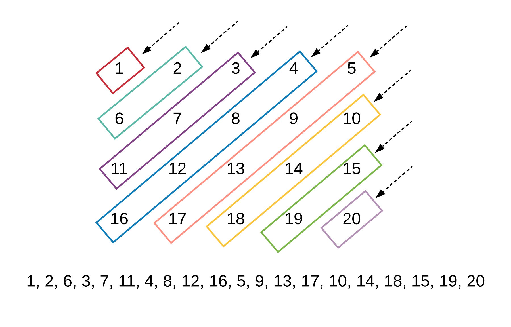

# **498. diagonalTraverse**

## **Link**

<https://leetcode.com/problems/diagonal-traverse/>

## **Description**

Given a matrix of M x N elements (M rows, N columns), return all elements of the matrix in diagonal order as shown in the below image.

    Input:
    [
    [ 1, 2, 3 ],
    [ 4, 5, 6 ],
    [ 7, 8, 9 ]
    ]

    Output:  [1,2,4,7,5,3,6,8,9]

    Explanation:


Note: The total number of elements of the given matrix will not exceed 10,000.

## **Analyse**

- method1: diagonal iteration and reverse
    1. simplify the question, first to find all diagonals;


    2. simplify the question(no going up or going down), traverse all the diagonal from up to down, so we can notice that all heads of diagonal are in the (first row, every col) and (last col, every row); 
    (from last img, horizontal is row, vertical is col); 
    
    3. indexing: [i, j] -> [i + 1, j - 1];

    4. from step 1 and step 2, we know that we can get [1, 2, 6, 3, 7, 11.........], however, what we want is [1, 2, 6, 11, 7, 3.........]. From observation, we notice that all going up diagonal is the even number diagonal(counting from left side), so we set up a var called direction, and check if it can module 2, if it can, then reverse the that diagonal.

    5. And we also need a intermiedia list to store diagonal each time for reversing. res list for all diagonals.

- method2: simulation
    1. first find out how the index going in the traverse.

    2. going up in diagonal: [i, j] -> [i - 1, j + 1];
    
    3. going down in diagonal: [i, j] -> [i + 1, j - 1];

    4. find the head after finishing going down


    5. find the head after finishing going up


    6. we also need a direction var to indicate going up or going down


## **Solution**

### diagonal iteration and reverse

>C++

```cpp
class Solution {
public:
    vector<int> findDiagonalOrder(vector<vector<int>>& {
        vector<int> res = {}, intermediate = {};
        
        // check empty matrix
        if (matrix.empty()) return res;
        
        auto n = matrix.size();
        auto m = matrix[0].size();
        for (auto i = 0; i < n + m - 1; ++i) {
            // init back to empty every loop
            intermediate = {};
            
            // find next head
            int row = i < m ? 0 : i - m + 1;
            int col = i < m ? i : m - 1;
            
            // indexing
            while (row < n && col > -1) {
                intermediate.push_back(matrix[row][col]);
                row++;
                col--;
            }
            
            /* 
             * we know that we need to reverse when num odd
             * however, in loop, we start from 0
             * so i % 2 == 0 -> this is odd
             */
            if (i % 2 == 0) reverse(intermediate.begin(), intermediate.end());
            
            // push_back to res
            for (auto j = 0; j < intermediate.size(); ++j) {
                res.push_back(intermediate[j]);
            }
        }
        
        return res;
    }
};
```

### simulation

>C++

```cpp
class Solution {
public:
    vector<int> findDiagonalOrder(vector<vector<int>>& matrix) {
        vector<int> res = {};

        if (matrix.empty()) return res;

        auto n = matrix.size();
        auto m = matrix[0].size();
        int row = 0, col = 0;
        // direction: diagonal goes up or goes down
        int dir = 1;

        // begin the simulation
        while (row < n && col < m) {
            res.push_back(matrix[row][col]);

            // indexing
            int new_row = row + (dir == 1 ? -1 : 1);
            int new_col = col + (dir == 1 ? 1 : -1);

            // if it is the time to find next head
            if (new_row < 0 || new_row == n || new_col < 0 || new_col == m) {
                if (dir == 1) {
                    row = row + (col == m - 1 ? 1 : 0);
                    col = col + (col < m - 1 ? 1 : 0);
                }
                else {
                    // be careful check row == n - 1 must be first
                    col = col + (row == n - 1 ? 1 : 0);
                    row = row + (row < n - 1 ? 1 : 0);
                }
                // flip around the direction
                dir = 1 - dir;
            }
            else {
                row = new_row;
                col = new_col;
            }
        }
    
        return res;
    }
};
```